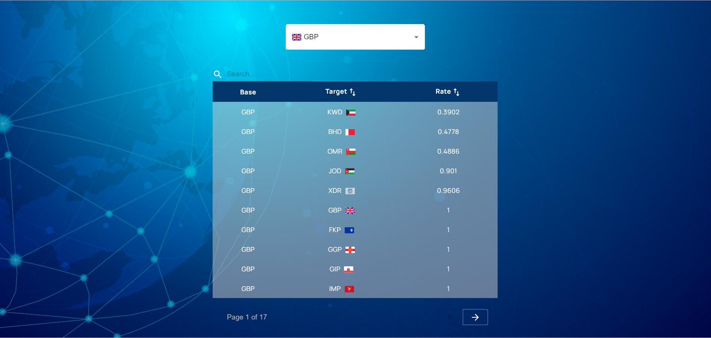

# Currencies Converter
## Project Description:
 application developed for converting currency exchange rates across various currencies worldwide. It provides precise and up-to-date information for currency conversion needs.

### Backend- Minimal-API 
- Implemented in C# .NET 8 using the minimal-api model.
- Utilizes an external API service to retrieve currency information.
- Features 2 endpoints:  
    1. Retrieve all available currencies  
    2. Retrieve conversion rates

### Client Side - React + Vite
- Developed using React with Vite.
- Includes server communication via the axios library.
- Implements a table using TanStack-Table library.
- Styling done using CSS and Material-UI library.

# Running Instructions:
# Clone the repository:
1. choose where to locate the project
2. in the CMD run: `git clone "https://github.com/rivki-gebel/Currencies-converter.git"`
## Running the API Locally:
1. Open the C# project in your development environment (e.g., Visual Studio).
2. Run the API server.

## Running the React Project:
1. Navigate to the React project directory.

2. Install dependencies using:
`npm install`

3. Start the React development server:
`npm start`

After completing these steps, the project will be available for use at `http://localhost:5137/`.
